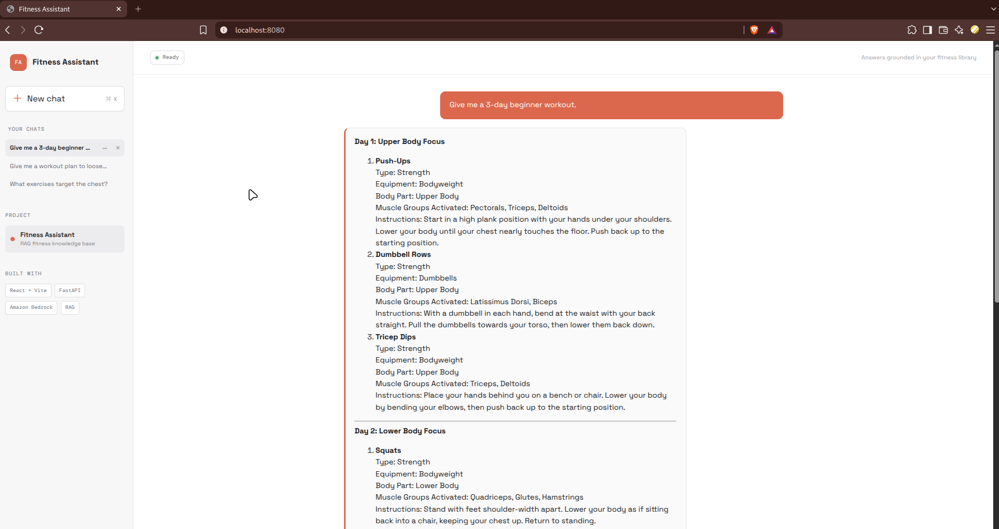
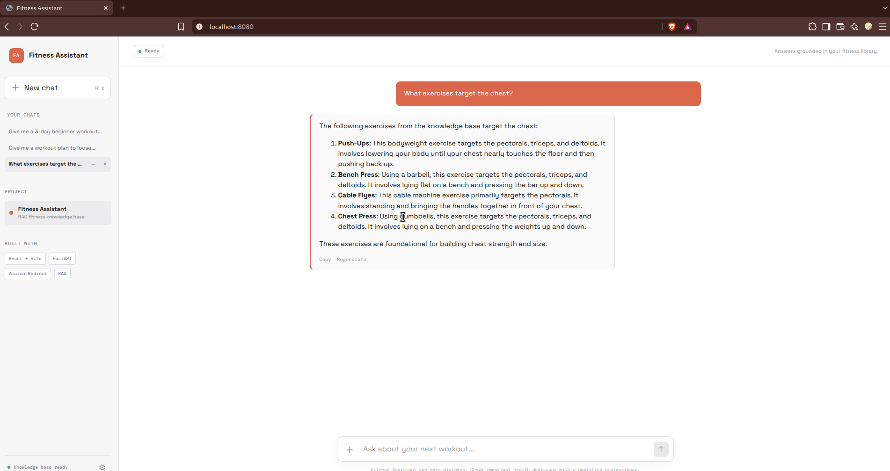
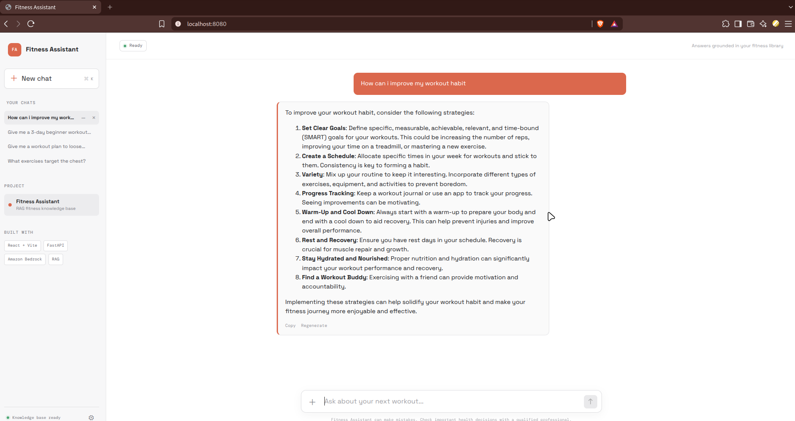
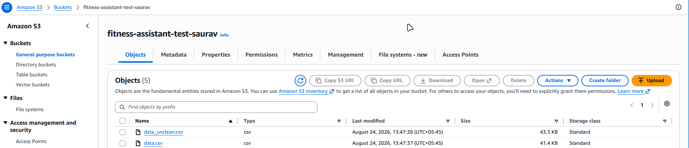
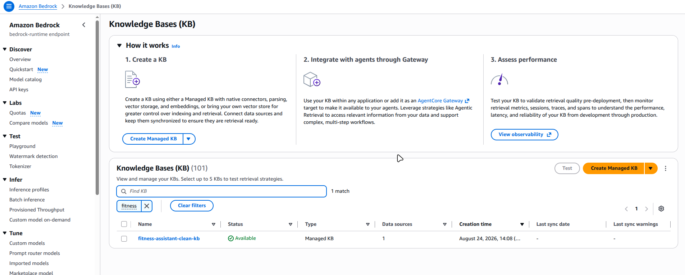
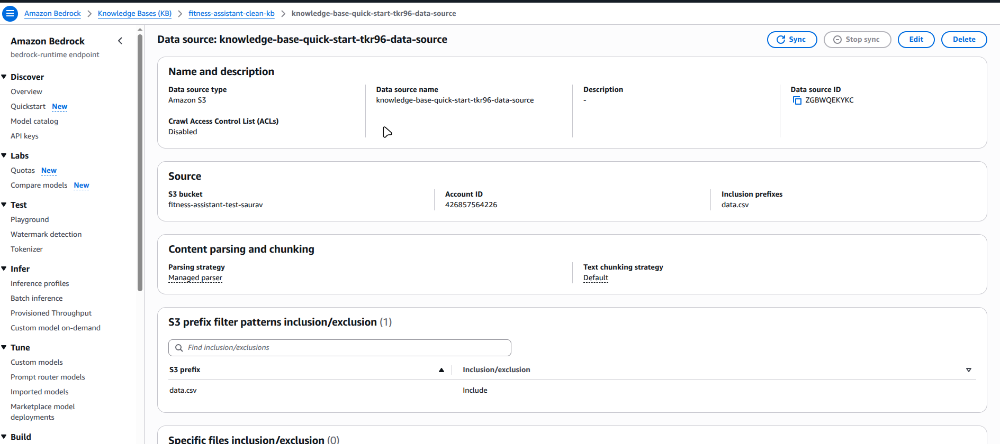

# Fitness Assistant

Small educational RAG application using Amazon Bedrock Knowledge Bases, FastAPI, and React.

## Current AWS data check

Configured source bucket: `<bucket>` in `us-east-1`.
The isolated Knowledge Base created for this project is `<id>`; its data source is configured with the `data.csv` inclusion prefix.

Suitable source formats include PDF, plain text, Markdown, HTML, CSV, and common office documents. Prefer clean, text-oriented files with one topic per document. Preprocess scanned PDFs with OCR and remove duplicated navigation or boilerplate. Metadata sidecar files are optional for the first version; add them later when filtering by equipment, level, or goal becomes useful.

For this learning project, start with the Bedrock console's default chunking and an Amazon Titan Text Embeddings V2 model. Use the console-created OpenSearch Serverless vector store because it is a supported, managed option with few moving parts. In production, tune chunk size and overlap against an evaluation set, restrict the S3 prefix, and review OpenSearch Serverless and Bedrock costs.

## AWS setup

1. Upload source documents, then verify them:

   ```bash
   aws s3 cp ./data/ s3://<bucket_name> --recursive --region us-east-1
   aws s3 ls <bucket_name> --recursive --region us-east-1
   ```

2. In the Amazon Bedrock console in `us-east-1`, open **Knowledge bases**, choose **Create**, and select the unstructured data S3 workflow. Set the S3 URI to `s3://<bucket_name>`, select Titan Text Embeddings V2, and allow the console to create the supported OpenSearch Serverless vector store. Record the resulting Knowledge Base ID and data source ID.

3. Sync the data source. The equivalent API shape is:

   ```bash
   aws bedrock-agent start-ingestion-job \
     --knowledge-base-id "$BEDROCK_KNOWLEDGE_BASE_ID" \
     --data-source-id "$BEDROCK_DATA_SOURCE_ID" \
     --region us-east-1
   aws bedrock-agent list-ingestion-jobs \
     --knowledge-base-id "$BEDROCK_KNOWLEDGE_BASE_ID" \
     --data-source-id "$BEDROCK_DATA_SOURCE_ID" \
     --region us-east-1
   ```

   Wait for `COMPLETE` and inspect failures before testing retrieval. Re-run `start-ingestion-job` after changing S3 documents.

The Knowledge Base service role needs read access to the selected S3 prefix and permission to invoke the embedding model. The application identity needs `bedrock:Retrieve` on the Knowledge Base and `bedrock:InvokeModel` on the chosen foundation model. Never put access keys in this repository; use the standard AWS credential chain or an IAM role.

## Run the retrieval test

```bash
cd backend
python -m venv .venv
source .venv/bin/activate
pip install -r requirements.txt
export AWS_REGION=us-east-1
export BEDROCK_KNOWLEDGE_BASE_ID=your-kb-id
python kb_test.py "What exercises target the chest?"
```

The script prints each retrieved chunk, score, location, and source metadata. This is the required checkpoint before generation.

Structured list questions such as “what exercises target the chest?” are routed to an exhaustive, read-only filter over `data.csv` in S3. Every matching row is then sent to Bedrock for synthesis. Exploratory questions use managed Knowledge Base retrieval with `BEDROCK_RETRIEVAL_RESULTS` (15 is the initial setting). The production UI does not render citations; source file information remains in the API payload and backend logs for evaluation.

## Run the application

Terminal 1:

```bash
cd backend
source .venv/bin/activate
export BEDROCK_KNOWLEDGE_BASE_ID=your-kb-id
export BEDROCK_MODEL_ID=your-converse-compatible-model-id
uvicorn app.main:app --reload --port 8000
```

Terminal 2 (requires Node.js/npm):

```bash
cd frontend
npm install
npm run dev
```

The API exposes `GET /health` and `POST /api/chat`. The chat response separates the generated Markdown answer from backend source metadata.

## Run with Docker Compose

Create a local `.env` file in the project root. It is ignored by git:

```bash
AWS_REGION=us-east-1
BEDROCK_KNOWLEDGE_BASE_ID=your-kb-id
BEDROCK_MODEL_ID=your-converse-compatible-model-id
AWS_PROFILE=default
```

Start both services:

```bash
docker compose up --build
```

Open `http://localhost:8080` for the Fitness Assistant UI. The frontend container serves the Vite build through Nginx and proxies `/api` to FastAPI. The backend is also available at `http://localhost:8001`, with `GET /health` exposed for container health checks. Compose mounts your local `~/.aws` directory into the backend container as read-only and uses `AWS_PROFILE` to select the profile. The profile needs `bedrock:Retrieve` and `bedrock:InvokeModel` permissions. Never commit credentials to this repository.

## Demo Screenshots

### Initial UI


### Chat interaction


### Query response


### Generated answer


### Follow-up question


### Final output


## Design choice

This first implementation uses **retrieve, then generate** so the retrieved context and prompt are easy to inspect. Because this is a managed Knowledge Base, the client uses `managedSearchConfiguration`. Bedrock's `RetrieveAndGenerate` can replace this later when managed session handling and built-in citations are more valuable than explicit control.